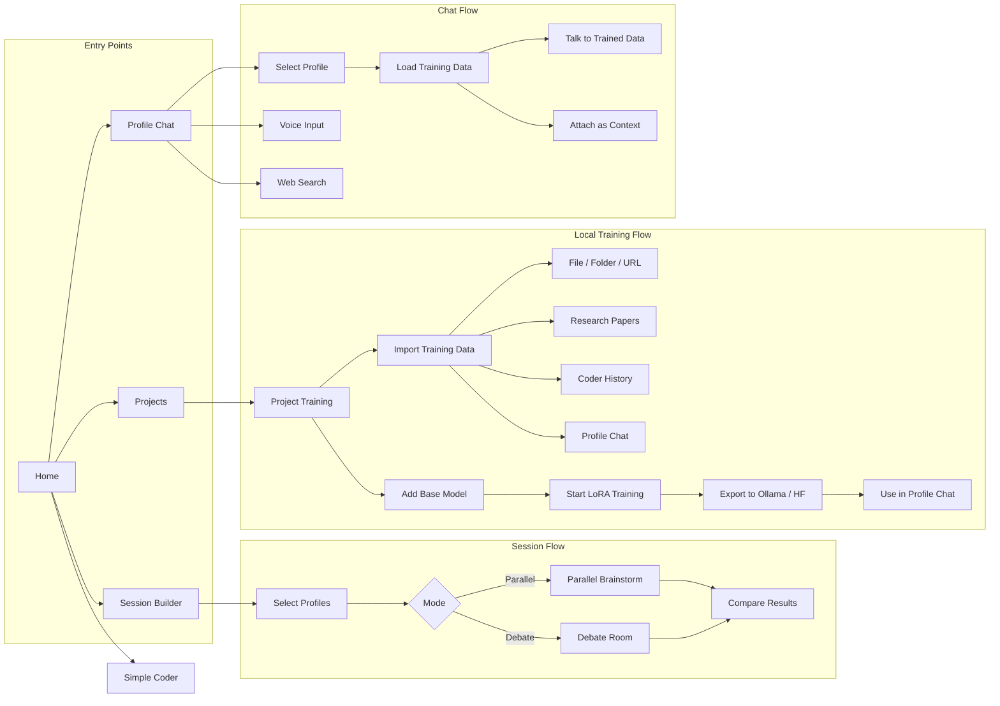
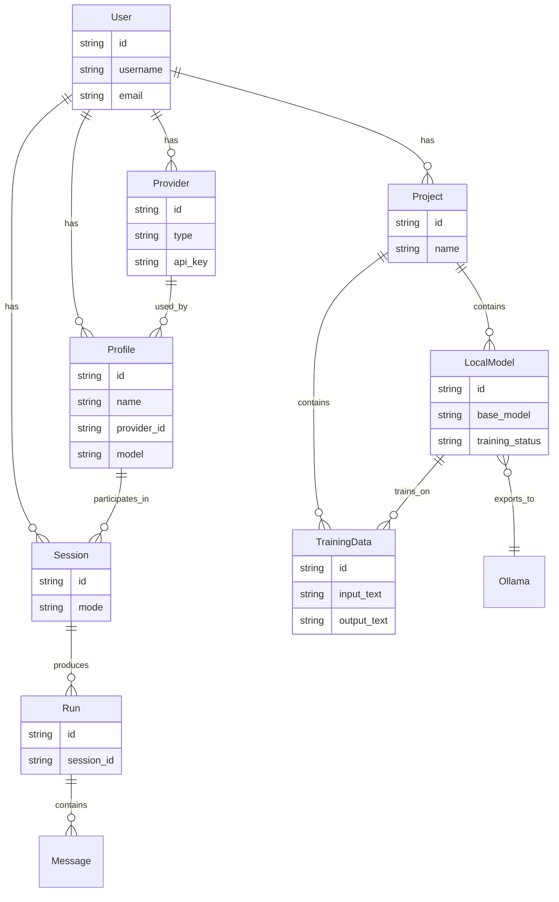
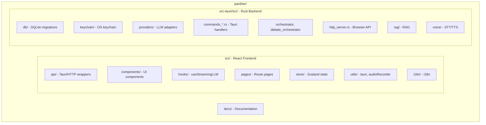

# Panther

**Advanced AI Agent Platform** — A desktop application for multi-LLM brainstorming, debate, local model training, and AI-assisted coding.

**Created by [Reza Mirfayzi](https://github.com/rezamirfayzi)**


## Features

- **Multi-Provider Support** — Connect to OpenAI, Anthropic, Google, OpenRouter, and local models (Ollama, LM Studio)
- **AI Profiles** — Create reusable personas with custom prompts, models, and parameters
- **Profile Chat** — Chat with AI profiles, load training data as context, voice input/output
- **Parallel Brainstorming** — Run multiple agents simultaneously on the same question
- **Debate Room** — Real-time agent discussions with turn-based rounds
- **Local Model Training** — Import training data (files, folders, research papers, chat history), train LoRA/QLoRA models, export to Ollama or HuggingFace
- **Simple Coder** — AI-assisted coding with Monaco editor
- **Agent Runs** — View and manage agent execution history
- **Secure Storage** — API keys stored in OS keychain (Windows Credential Manager)
- **Local-First** — All data stored locally in SQLite
- **Voice** — Optional local Whisper STT and TTS for hands-free conversation

## Architecture Overview

```mermaid
flowchart TB
    subgraph Frontend["Frontend (React + TypeScript)"]
        Home[Home Dashboard]
        Providers[Providers]
        Profiles[Profiles]
        ProfileChat[Profile Chat]
        Projects[Projects]
        ProjectTraining[Project Training]
        SessionBuilder[Session Builder]
        Sessions[Sessions]
        ParallelBrainstorm[Parallel Brainstorm]
        DebateRoom[Debate Room]
        SimpleCoder[Simple Coder]
        AgentRuns[Agent Runs]
        Settings[Settings]
    end

    subgraph State["State (Zustand)"]
        Store[(App Store)]
    end

    subgraph API["API Layer"]
        Invoke[Tauri Invoke]
        HTTP[HTTP REST]
    end

    subgraph Backend["Backend (Rust + Tauri)"]
        DB[(SQLite DB)]
        Keychain[Keychain]
        Orchestrator[Orchestrator]
        DebateOrchestrator[Debate Orchestrator]
        subgraph Commands["Tauri Commands"]
            Auth[Auth]
            Profile[Profile]
            Chat[Chat]
            Training[Training]
            Import[Import]
            Ollama[Ollama]
            RAG[RAG]
            Coder[Coder]
            Voice[Voice]
            Web[Web Search]
        end
        subgraph ProvidersBackend["Provider Adapters"]
            OpenAI[OpenAI]
            Anthropic[Anthropic]
            Google[Google]
            OllamaAdapter[Ollama]
            LocalHTTP[Local HTTP]
        end
    end

    Home --> Store
    Providers --> Store
    Profiles --> Store
    ProfileChat --> Store
    Projects --> Store
    ProjectTraining --> Store
    SessionBuilder --> Store
    Sessions --> Store
    ParallelBrainstorm --> Store
    DebateRoom --> Store
    SimpleCoder --> Store
    AgentRuns --> Store

    Home --> Invoke
    Providers --> Invoke
    Profiles --> Invoke
    ProfileChat --> Invoke
    ProfileChat --> HTTP
    Projects --> Invoke
    ProjectTraining --> Invoke
    SessionBuilder --> Invoke
    ParallelBrainstorm --> Invoke
    DebateRoom --> Invoke
    SimpleCoder --> Invoke
    AgentRuns --> Invoke

    Invoke --> Commands
    HTTP --> Commands

    Auth --> DB
    Profile --> DB
    Chat --> ProvidersBackend
    Training --> DB
    Training --> OllamaAdapter
    Import --> DB
    Ollama --> OllamaAdapter
    RAG --> DB
    Coder --> ProvidersBackend
    Voice --> OllamaAdapter

    Auth --> Keychain
    Profile --> Keychain
    Chat --> Keychain

    Orchestrator --> DebateOrchestrator
    Orchestrator --> ProvidersBackend
    DebateOrchestrator --> ProvidersBackend
```



## Application Flow Diagram



## Data Model Connections



## Safe to Share Publicly

**Yes — this repository is safe to share publicly.** No API keys, credentials, or sensitive data are included.

| What | Status |
|------|--------|
| API keys | **Never stored in code** — users add them via Settings; stored in OS keychain |
| Database | **Not in repo** — created at `%APPDATA%\panther\` on first run |
| `.env` files | **Excluded** — `.gitignore` blocks `.env`, `.env.local` |
| Production build | **Sanitized** — `npm run build:production` excludes all secrets |
| Source copy | **Sanitized** — `production/source/` has no keys, no `.git`, no user data |

The `production/source/` folder (from `npm run copy:source`) is explicitly prepared for public sharing.

## Prerequisites

- **Rust** — [Install from rust-lang.org](https://www.rust-lang.org/tools/install)
- **Node.js** — [Install from nodejs.org](https://nodejs.org/)
- **Windows 10/11** (64-bit)
- **macOS** (Intel or Apple Silicon) — build via [GitHub Actions](#mac-builds-via-github-actions)

### Optional: Local Voice (STT/TTS)

For local Whisper speech-to-text, see [docs/VOICE.md](docs/VOICE.md).

## Installation

```bash
# Clone the repository
git clone https://github.com/your-org/panther.git
cd panther

# Install dependencies
npm install

# Run in development mode
npm run tauri dev

# Build for production
npm run tauri build

# Build and copy to production/ folder (no keys or sensitive data included)
npm run build:production
```

The `build:production` script creates a `production/` folder with:
- Standalone executable and installers (**no API keys or sensitive information**)
- `production/source/` — GitHub-ready source code (sanitized, no keys, no `.git`)

To copy only the source without building: `npm run copy:source`

## Usage

### Providers

1. Go to **Settings → Providers**
2. Click **Add Provider**
3. Choose type: OpenAI Compatible, Anthropic, Google, or Local HTTP (Ollama)
4. Enter API key (or base URL for local) and test connection

### Profiles

1. Go to **Settings → Profiles**
2. Click **Create Profile**
3. Set name, provider, model, persona prompt, and generation parameters

### Profile Chat

1. From Home, click **Chat with [Profile]** or go to **Profiles** and open a profile
2. Optionally load training data as context or use **Talk to Trained Data**
3. Use voice input for hands-free conversation

### Local Model Training

1. Go to **Settings → Local Training Session** (Projects)
2. Create a project
3. Add a base model from Ollama (e.g., `llama3`, `gemma2:9b`)
4. Import training data: files, folders, research papers (PDF), coder history, or profile chat
5. Start LoRA/QLoRA training
6. Export to Ollama or HuggingFace
7. Use the trained model in Profile Chat

### Sessions (Parallel / Debate)

1. Click **New Session** from Home
2. Enter your question
3. Select mode: **Parallel Brainstorm** or **Debate Room**
4. Choose 2–10 profiles
5. Click **Start Session**

## Project Structure



### Folder Breakdown

| Folder | Purpose |
|--------|---------|
| **src/api/** | Tauri `invoke()` and HTTP fetch wrappers for all backend commands |
| **src/components/** | Reusable UI: AuthModal, ImportTrainingDataModal, LoraTrainingModal, VoiceInput, etc. |
| **src/hooks/** | `useStreamingLLM` — streaming chat with profiles |
| **src/pages/** | Route pages: Home, ProfileChat, ProjectTraining, SessionBuilder, SimpleCoder, etc. |
| **src/store/** | Zustand store: providers, profiles, projects, sessions, theme, voice settings |
| **src-tauri/src/db/** | SQLite schema, migrations |
| **src-tauri/src/keychain/** | Windows Credential Manager for API keys |
| **src-tauri/src/providers/** | OpenAI, Anthropic, Google, Ollama, Local HTTP adapters |
| **src-tauri/src/commands_*.rs** | Auth, chat, training, import, ollama, RAG, voice, etc. |
| **src-tauri/src/rag/** | RAG retrieval and grounding |
| **src-tauri/src/voice/** | Whisper STT, TTS |

### Full Tree

```
panther/
├── src/                         # React frontend
│   ├── api/index.ts             # All Tauri/HTTP API calls
│   ├── components/              # AuthModal, ImportTrainingDataModal, LoraTrainingModal,
│   │                            # VoiceInput, VoiceOutput, MenuBar, etc.
│   ├── hooks/useStreamingLLM.ts # Streaming LLM chat
│   ├── pages/                   # Home, ProfileChat, ProjectTraining, SessionBuilder,
│   │                            # ParallelBrainstorm, DebateRoom, SimpleCoder, etc.
│   ├── store/index.ts           # Zustand: providers, profiles, projects, sessions
│   ├── utils/                   # tauri.ts, audioRecorder.ts
│   └── i18n/                    # Language/RTL
├── src-tauri/
│   └── src/
│       ├── db/                  # SQLite + migrations
│       ├── keychain/            # OS keychain (API keys)
│       ├── providers/           # openai, anthropic, google, ollama, local_http
│       ├── commands_*.rs        # Auth, chat, training, import, ollama, RAG, voice
│       ├── orchestrator.rs      # Session execution
│       ├── debate_orchestrator.rs
│       ├── http_server.rs       # Browser mode REST API
│       ├── rag/                 # RAG retrieval
│       ├── voice/               # Whisper STT, TTS
│       └── cline/               # Agent tools
├── docs/                        # ARCHITECTURE.md, VOICE.md
├── production/                  # Build output (build:production)
│   └── source/                  # GitHub-ready source (no secrets)
└── scripts/                     # build-production.ps1, copy-source-for-github.ps1
```

## Tech Stack

| Layer | Technology |
|-------|------------|
| Frontend | React 19, TypeScript, Vite, Zustand, React Router |
| Backend | Rust, Tauri 2 |
| Database | SQLite |
| Security | OS Keychain (Windows Credential Manager) |
| LLM | OpenAI, Anthropic, Google, Ollama, OpenRouter |

## Browser Mode

The app can run in browser mode with an HTTP backend:

```bash
# Terminal 1: Start HTTP backend
npm run dev:server

# Terminal 2: Start Vite dev server
npm run dev
```

Then open `http://localhost:1420` (or the port shown). The backend runs on port 3001 by default.

## Mac Builds via GitHub Actions

**macOS builds cannot be created on Windows** — Tauri does not support cross-compilation. Use GitHub Actions to build for Mac:

1. Push your code to a GitHub repo
2. Go to **Actions** → **Build Release** → **Run workflow**
3. Or push to the `release` branch to trigger automatically
4. When the workflow completes, a draft release will have:
   - **Windows**: `.exe` installer, `.msi`
   - **macOS (Apple Silicon)**: `.dmg`
   - **macOS (Intel)**: `.dmg`

Ensure **Settings → Actions → Workflow permissions** is set to "Read and write permissions".

## Author

**Reza Mirfayzi**

## License

MIT
