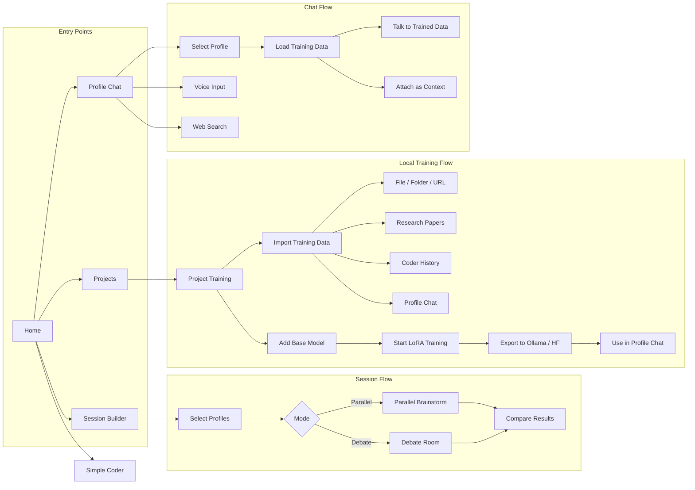
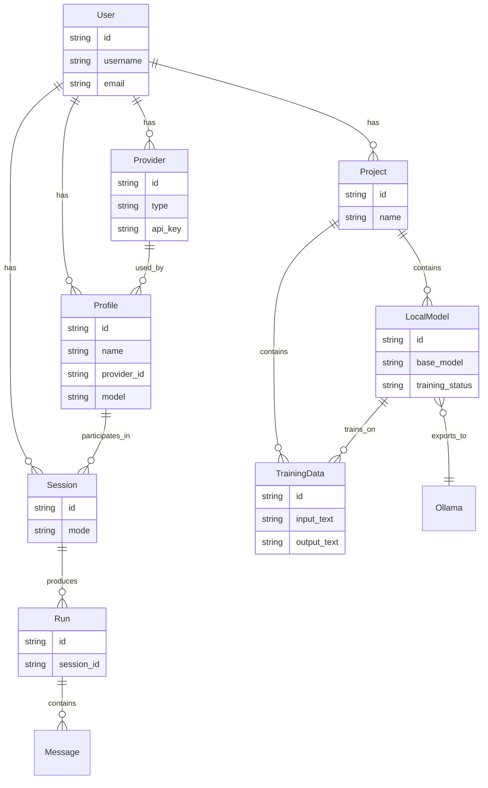
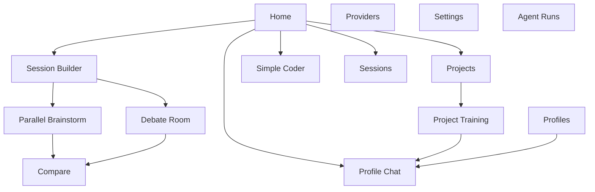
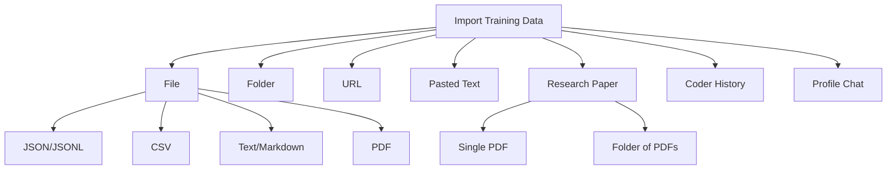
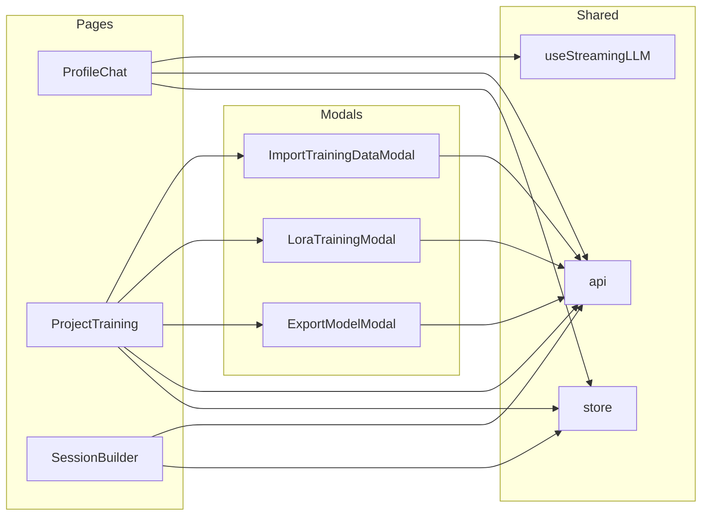

# Panther Architecture

This document contains Mermaid diagrams showing how the application is structured and how components connect.

## System Architecture

```mermaid
flowchart TB
    subgraph Frontend["Frontend (React + TypeScript)"]
        direction TB
        Home[Home Dashboard]
        Providers[Providers]
        Profiles[Profiles]
        ProfileChat[Profile Chat]
        Projects[Projects]
        ProjectTraining[Project Training]
        SessionBuilder[Session Builder]
        Sessions[Sessions]
        ParallelBrainstorm[Parallel Brainstorm]
        DebateRoom[Debate Room]
        SimpleCoder[Simple Coder]
        AgentRuns[Agent Runs]
        Settings[Settings]
    end

    subgraph State["State (Zustand)"]
        Store[(App Store)]
    end

    subgraph API["API Layer"]
        Invoke[Tauri Invoke]
        HTTP[HTTP REST]
    end

    subgraph Backend["Backend (Rust + Tauri)"]
        DB[(SQLite DB)]
        Keychain[Keychain]
        Orchestrator[Orchestrator]
        DebateOrchestrator[Debate Orchestrator]
        subgraph Commands["Tauri Commands"]
            Auth[Auth]
            Profile[Profile]
            Chat[Chat]
            Training[Training]
            Import[Import]
            Ollama[Ollama]
            RAG[RAG]
            Coder[Coder]
            Voice[Voice]
            Web[Web Search]
        end
        subgraph ProvidersBackend["Provider Adapters"]
            OpenAI[OpenAI]
            Anthropic[Anthropic]
            Google[Google]
            OllamaAdapter[Ollama]
            LocalHTTP[Local HTTP]
        end
    end

    Home --> Store
    Providers --> Store
    Profiles --> Store
    ProfileChat --> Store
    Projects --> Store
    ProjectTraining --> Store
    SessionBuilder --> Store
    Sessions --> Store
    ParallelBrainstorm --> Store
    DebateRoom --> Store
    SimpleCoder --> Store
    AgentRuns --> Store

    Home --> Invoke
    Providers --> Invoke
    Profiles --> Invoke
    ProfileChat --> Invoke
    ProfileChat --> HTTP
    Projects --> Invoke
    ProjectTraining --> Invoke
    SessionBuilder --> Invoke
    ParallelBrainstorm --> Invoke
    DebateRoom --> Invoke
    SimpleCoder --> Invoke
    AgentRuns --> Invoke

    Invoke --> Commands
    HTTP --> Commands

    Auth --> DB
    Profile --> DB
    Chat --> ProvidersBackend
    Training --> DB
    Training --> OllamaAdapter
    Import --> DB
    Ollama --> OllamaAdapter
    RAG --> DB
    Coder --> ProvidersBackend
    Voice --> OllamaAdapter

    Auth --> Keychain
    Profile --> Keychain
    Chat --> Keychain

    Orchestrator --> DebateOrchestrator
    Orchestrator --> ProvidersBackend
    DebateOrchestrator --> ProvidersBackend
```

## Application Flow

## Data Model

## Page Navigation

## Training Data Import Sources

## Component Dependencies

